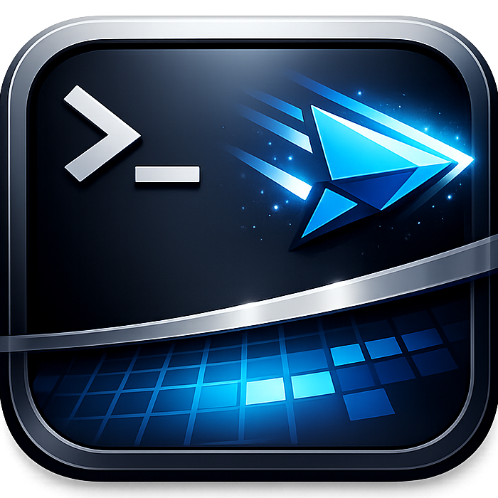
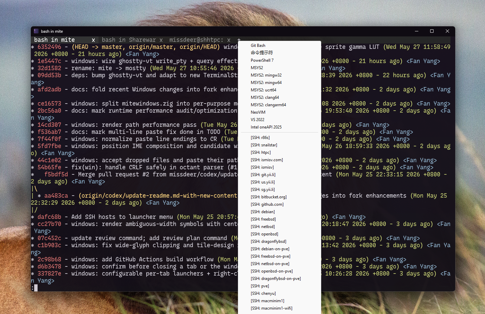

<h1>

  
   Mostty

</h1>

A native terminal emulator with libghostty at its core.

> Forked from [marler8997/mite](https://github.com/marler8997/mite).
>
> Windows only. If you need a macOS or Linux build, use [ghostty](https://github.com/ghostty-org/ghostty) directly.

### Windows

Uses Direct3D 11 and DirectWrite for text. Compiles to a tiny executable (less than 2 MB with ReleaseSmall).

#### Fork enhancements (Windows)

This fork adds several Windows-side enhancements on top of upstream:

- Configurable startup launchers per tab, including right-click `+` launcher selection and SSH hosts integrated into the launcher menu.
- Confirmation prompts before closing a tab or the window to reduce accidental session loss.
- User configuration via `%LOCALAPPDATA%\Mostty\config`: font family/size, colors and Ghostty-compatible themes (with live light/dark switching), per-tab launchers, window transparency (`background-opacity` / `background-blur`, the latter toggling DWM blur-behind so users can opt out of the default Aero-style translucency), and initial window state (`maximize` / `fullscreen`). See [Configuration](configurations.md).
- Rendering improvements for wide-glyph clipping, tile-design handling, ambiguous-width symbol alignment/readability, and CRLF tolerance in the octant glyph parser.
- Drag-and-drop from Explorer: dropped files are pasted as space-separated, double-quoted paths into the active tab (works under elevation via UIPI message filters).
- IME composition and candidate windows track the caret cell instead of opening at the screen corner; the position re-pins if PTY output scrolls mid-composition.
- Multi-line clipboard paste preserves line breaks by normalizing CRLF and bare LF to CR (matches xterm bracketed-paste, alacritty/kitty/foot).
- Double-click selects the word under the cursor and copies it to the clipboard; boundary set tuned so URLs/paths/`$VAR`/`key:value` stay one token while `user@host` splits, with CJK-aware punctuation (sentences split at `，。！？「」` etc.) and wide-char right-half clicks resolved to the primary cell.
- Hover-detect http/https URLs across visually-wrapped rows — matched cells get an underline, the cursor turns into a hand, and double-click opens the link via `ShellExecuteW`. The walker crosses row boundaries on URL-character continuity rather than `row.wrap`, so producer hard-wrapped output (e.g. `bat` defaulting to character wrap) is linkified the same as terminal soft-wrap. Detection re-validates from the render path so PTY scroll, resize, and viewport snap-back all keep the highlight in sync without per-event hooks; silently-truncated runs at the 4 KiB cap are rejected so a host-shortened prefix can't be opened.
- Render hot-path performance pass: coalesced `InvalidateRect` via a `render_pending` flag, per-frame LRU dampening in the glyph cache, per-render selection-bounds precompute (replaces per-cell page walks), and a pow-free shader gamma decode approximation kept close to DirectWrite's gamma 2.2 rendering params.
- Automated Windows builds via GitHub Actions, plus repository assistant tooling/docs updates for contributors.

**Tabs.** One window can host multiple ConPTY-backed shells. The tab bar is painted into the top cell row of the same D3D11 surface (no extra Win32 control). Each tab owns its own terminal state, vt stream, child process, reader thread, title, and WM_CHAR surrogate carry; window-scoped state (mouse capture, scrollbar drag, selection fade) stays on the window. Closing the last tab quits.

- `Ctrl+T` — new tab (uses the first configured launcher, or `cmd.exe` if none)
- `Ctrl+W` — close the active tab
- `Ctrl+Tab` / `Ctrl+Shift+Tab` / `Ctrl+PgDn` / `Ctrl+PgUp` — cycle tabs
- `Ctrl+1`..`Ctrl+9` — jump to tab N
- Left-click a tab to activate, its `x` to close, the `+` to open a new one
- Right-click the `+` to pick a launcher from the configured list

Tab teardown sets an atomic `reader_stop` and calls `CancelIoEx` so the reader thread exits cleanly whether it was blocked in `ReadFile` or mid-`SendMessage`, and the main loop waits on all child process handles via `MsgWaitForMultipleObjectsEx` so an exiting shell posts a close instead of killing the process.

Custom shells / startup programs are declared as `launcher` lines in `%LOCALAPPDATA%\Mostty\config` — see [Configuration](configurations.md). A failed launcher (bad path, missing exe) logs an error and skips the new tab rather than crashing Mostty.

**Font configuration.** Defaults: primary family **Consolas @ 13pt** with a minimal hardcoded fallback chain (`Segoe UI Emoji`) attached via a custom `IDWriteFontFallback`. Cell size is measured from `IDWriteFontFace` design metrics rather than a text layout of U+2588 — some monospace fonts (Rec Mono Casual included) report a wider full-block glyph than their ASCII advance, which used to stretch every letter horizontally. Sizes are configured in points and converted pt → DIPs → physical pixels (the previous DIP-direct path rendered "13pt" at ~75% of intended size). If the configured primary isn't installed, Mostty falls back through Cascadia Mono → Consolas → Courier New for cell-size measurement before erroring out.

Font family and size (and colors, themes, and launchers) are overridable via `%LOCALAPPDATA%\Mostty\config` — see [Configuration](configurations.md) for all keys and the file format.

The child shell is spawned with an isolated per-process Unicode environment block (`TERM`/`COLORTERM`/`LANG`/`LC_ALL` applied, `NO_COLOR` stripped, sorted case-insensitively as Win32 requires) instead of mutating Mostty's own process env, which removes a race across concurrent `CreateProcessW` calls.

**Sharper text rendering.** Three coupled changes that together visibly crisp up the glyphs:

- The glyph atlas and D2D staging surface are now `BGRA8` with `D2D1_TEXT_ANTIALIAS_MODE_CLEARTYPE`; the shader treats the stored RGB as a 3-component subpixel coverage mask. Atlas dimension is capped at 4096 (~64 MiB) with a min-2 guard so the LRU's head/tail invariant survives extreme cell sizes.
- The render target view is created as `B8G8R8A8_UNORM_SRGB` and shader inputs (fg/bg/gradient/atlas) use a pow-free decode approximation close to gamma 2.2, so blending happens in linear space while avoiding the old per-pixel `pow` hotspot. A custom `IDWriteRenderingParams` (gamma 2.2, contrast 0, ClearType, RGB stripe, `NATURAL_SYMMETRIC`) is built once and applied per glyph so the atlas is reproducible across machines.
- The per-glyph horizontal `SetTransform` that scaled fallback glyphs to the cell advance is gone — it was destroying hinting on every non-ASCII glyph. Fallback glyphs now render at their natural advance and over/underflow is clipped or padded by the cell.
