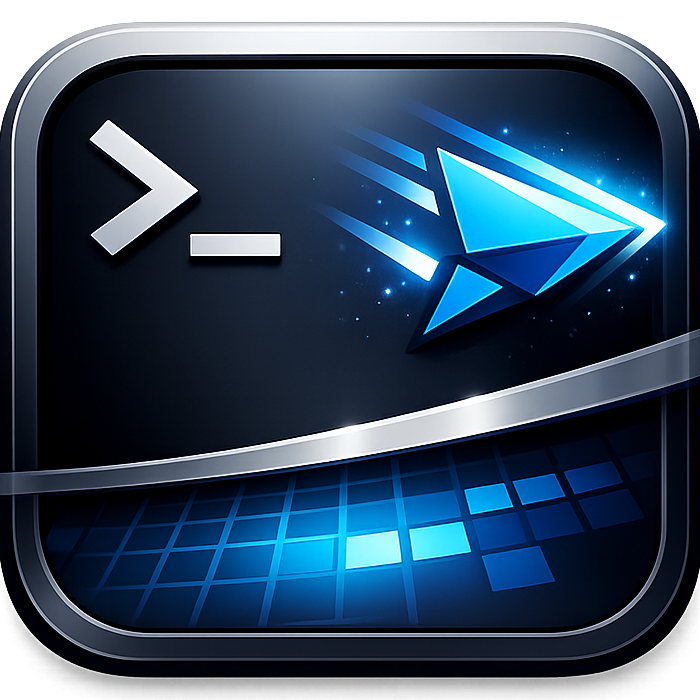
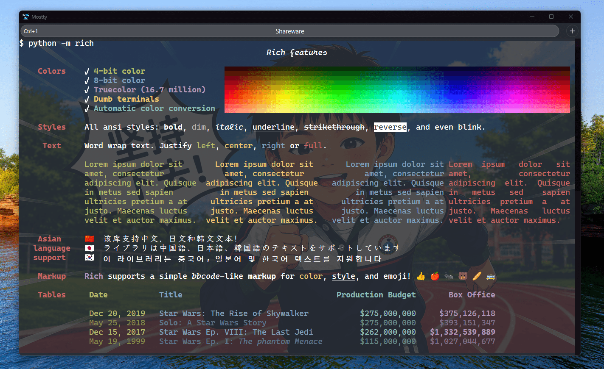

<h1>
<p align="center">
  
  <br>Mostty
</p>
</h1>

A fast, lightweight native terminal emulator with libghostty at its core. Runs natively on Windows 10/11 and macOS 13+.

> Inspired by [marler8997/mite](https://github.com/marler8997/mite).
>
> Windows and macOS. If you need a Linux build, use [ghostty](https://github.com/ghostty-org/ghostty) directly.

### Features

Both Windows and macOS provide:

- **Tabbed sessions.** Multiple independent shells in one window, with independent terminal state and titles. Right-click `+` to choose a configured launcher or an SSH host discovered from `~/.ssh/config`. Tabs close when their shell exits; closing the last tab quits the app. Manual tab/window closure prompts for confirmation by default.
- **Live configuration and themes.** Change fonts, terminal colors, the palette, cursor and selection colors, transparency, blur, and render cadence through a plain-text config file. Saving the file updates running tabs. Bundled and user-installed Ghostty-compatible color themes can also be selected from a menu. Launcher and environment changes apply to new sessions; maximize/fullscreen settings apply at startup.
- **Unicode text and terminal glyphs.** Native font rendering with bold/italic faces, wide characters, grapheme clusters, and system font fallback. Shared procedural glyph rendering keeps box drawing, blocks, braille, Powerline separators, and legacy computing symbols aligned to the cell grid.
- **Selection and clipboard.** Drag to select text and release to copy automatically. Double-click selects words with CJK-aware punctuation boundaries and correct handling of wide characters and wrapped text. Multiline paste normalizes line endings to terminal Enter; bracketed paste is used when requested by the application, with embedded paste-end markers removed.
- **Clickable URLs.** Hover over HTTP/HTTPS links to underline them and show a hand cursor; double-click opens them in the default browser. Detection spans visually wrapped rows and stays in sync with scrolling and resizing.
- **File drag-and-drop.** Drop files from Explorer or Finder to paste space-separated, quoted paths into the active session. macOS escapes shell-special characters inside those paths.
- **Scrollback and mouse input.** Browse terminal history with the mouse wheel or a draggable scrollbar. Terminal applications can receive mouse clicks, drags, motion, and wheel events through the negotiated VT mouse protocol; hold `Shift` to use local selection/scrolling instead.
- **IME input.** CJK and other input methods show composition and candidate UI at the terminal caret.
- **Terminal inline images.** Display Kitty, Sixel, and iTerm2 images with placement clipping and scrolling. Kitty also supports layering, replacement, and deletion. Sixel and iTerm2 advance the cursor below the image; iTerm2 accepts pixel, cell, percentage, and automatic sizes. Set `images-enabled = false` to discard all three image protocols; the setting reloads live and removes existing images. Windows requires a ConPTY version that forwards image sequences; see below.

See [Configuration](configurations.md) for syntax, examples, defaults, and the full [platform support table](configurations.md#platform-support).

### Windows

Uses DirectWrite for text and supports Direct3D 11, Direct3D 12, OpenGL 4.6, and Vulkan renderers. Direct3D 11 remains the default validated backend; the other backends are explicit research options. Compiles to a single native executable.



#### Renderer backends

| Value | Rendering and presentation path |
| --- | --- |
| `d3d11` | Default validated Direct3D 11 renderer with native DirectComposition presentation. |
| `d3d12` | Direct3D 12 research renderer using signed DXIL and native DirectComposition presentation. |
| `opengl` | OpenGL 4.6 research renderer using shared SPIR-V shaders and a DirectComposition interoperability bridge when available. |
| `pure-opengl` | The same OpenGL renderer presented directly through a double-buffered WGL window. |
| `vulkan` | Vulkan research renderer presented through the Vulkan/D3D11 DirectComposition bridge. |
| `native-vulkan` | The same Vulkan renderer presented through a native Win32 Vulkan surface and swapchain; opaque-only surfaces require opaque window settings. |

Select a backend in `%LOCALAPPDATA%\Mostty\config`:

```text
renderer = d3d12
```

Or override the configured backend for one process:

```powershell
Mostty.exe --renderer native-vulkan --background-opacity 1 --background-blur false
```

`--background-opacity <0..1>` and `--background-blur <true|false>` override the
matching config values at startup without editing the file; a later config
reload can replace those opacity and blur overrides. The active renderer stays
fixed until restart. See [Command-line options](configurations.md#command-line-options)
for all accepted options, including legacy font options that are parsed but
not applied.

Windows D3D11, D3D12, OpenGL and pure OpenGL support native panes within each tab: use the split shortcuts below,
click or navigate by direction to focus a pane, and drag dividers to resize.
The window’s system menu also exposes split, close-pane and maximize/restore
commands when another app intercepts a keyboard shortcut. Pane maximize/restore
and tab switching retain the running shells. Closing a pane
collapses its region; closing the last pane closes the tab. The per-window limit
is 63 sessions across at most 32 tabs. Vulkan variants keep their single-surface
behavior and explicitly reject split requests without changing renderer.

Renderer changes require a restart. Unsupported drivers or presentation capabilities are reported at startup; research backends may offer an explicit D3D11 fallback but never switch silently. See [Configuration](configurations.md#renderer) for requirements and backend-specific behavior.

#### Windows-specific features

- **ConPTY sessions**, using the first configured launcher or `cmd.exe` by default.
- **Advanced DirectWrite font controls:** configurable fallback and emoji font chains, programming ligatures and OpenType features, per-codepoint font mapping, style and synthetic-style controls, and a separate tab-bar font. The default terminal font is **Consolas at 13pt**.
- **ClearType text with asynchronous glyph rasterization**, glyph caching, and partial redraws. Separate local and remote/software rendering intervals help control resource usage.
- **Window appearance:** background images with fit, position, repeat, and opacity controls; DWM blur-behind; and live system light/dark theme switching with `theme = light:..., dark:...`.
- **Desktop integration:** open/create `%LOCALAPPDATA%\Mostty\config` through **Open Settings File...** in the window system menu, switch themes from that menu, and accept Explorer file drops even when running elevated.

Windows always prompts before manually closing sessions; `confirm-close-surface` currently only controls the macOS behavior.

**Bundled ConPTY for Kitty graphics.** On Windows, the inbox ConPTY can filter Kitty's APC image sequences before Mostty's VT parser sees them. Mostty therefore looks for an experimental Microsoft Terminal ConPTY in this order:

1. `MOSTTY_CONPTY_DLL`
2. `<Mostty.exe directory>\conpty\conpty.dll`
3. system `CreatePseudoConsole`

Windows release archives bundle `conpty.dll` and `OpenConsole.exe` in the `conpty/` directory beside `Mostty.exe`. CI verifies the downloaded package and binaries with SHA256 hashes. Local development can use the same layout under `zig-out\bin\conpty\`.

### macOS

A native SwiftUI/AppKit application using PTY sessions, CoreText text rendering, and Metal presentation on the same `libghostty-vt` terminal core. Requires macOS 13 or newer. Building requires Zig 0.16.0 and full Xcode 26 or newer for the Icon Composer asset compiler (`actool`). `zig build` on a macOS host assembles a launchable `Mostty.app` into `zig-out/`, and CI publishes an arm64 `.dmg` on tagged releases.

#### macOS-specific features

Configuration is read from `~/Library/Application Support/com.dfordsoft.mostty.terminal/Config`;
use **Mostty > Open Configuration File** (`Cmd+,`) to open or create it.
See [Configuration](configurations.md#platform-support) for supported keys,
platform differences, and examples; macOS does not use the Windows command-line overrides.

- **Login-shell startup.** New tabs use the first configured launcher, or the user's login shell, and start in the configured working directory or `$HOME`. Tab titles reflect the shell-provided title and current directory.
- **Native session and window commands.** The **Tabs** menu provides tab navigation; `Ctrl+Cmd+F` toggles native fullscreen. Closing an active session, the window, or the app prompts by default; `confirm-close-surface = false` disables these prompts.
- **Native appearance and scrolling.** Retina-aware CoreText rendering, a native scrollbar with thumb dragging and page clicks, trackpad scrollback, and configurable translucent backgrounds with an AppKit blur backdrop. Window chrome stays dark; `light:..., dark:...` theme pairs select the dark variant.
- **Live theme selection.** **Mostty > Theme** changes all tabs immediately while retaining explicit color overrides. Menu choices last until the next config reload or restart.
- **Kitty graphics over the native PTY.** Supports RGB/RGBA and PNG images, chunked transmissions and replies, Unicode placeholder placements, and images below or above text, without a bundled ConPTY dependency.

The default terminal font is **Menlo at 13pt**. Font size and regular/bold/italic/bold-italic families are configurable; macOS uses only the first `font-family` entry and lets CoreText resolve missing glyphs. Windows-only controls for ligatures, OpenType features, custom fallback/emoji chains, codepoint maps, synthetic styles, tab-bar fonts, background images, GPU/backend selection, and remote-session render cadence are not applied on macOS.

### Shortcuts and mouse actions

| Action | Windows | macOS |
| --- | --- | --- |
| New tab | `Ctrl+T` | `Cmd+T` |
| Close active tab | `Ctrl+W` | `Cmd+Shift+W` |
| Next tab | `Ctrl+Tab` or `Ctrl+PgDn` | `Cmd+Shift+]` |
| Previous tab | `Ctrl+Shift+Tab` or `Ctrl+PgUp` | `Cmd+Shift+[` |
| Select tab 1-9 | `Ctrl+1` through `Ctrl+9` | `Cmd+1` through `Cmd+9` |
| Copy selection | Automatic on selection release | Automatic on selection release, or `Cmd+C` |
| Paste | `Ctrl+V`, `Ctrl+Shift+V`, or `Shift+Insert` | `Cmd+V` |
| Split left/right | `Ctrl+Shift+D` | `Cmd+D` |
| Split up/down | `Ctrl+Shift+E` | `Cmd+Shift+D` |
| Close active pane | `Ctrl+Shift+W` | `Cmd+W` |
| Focus pane by direction | `Ctrl+Alt+Arrow` | `Cmd+Option+Arrow` |
| Maximize/restore pane | `Ctrl+Shift+Enter` | `Cmd+Shift+Enter` |
| Toggle fullscreen | `Alt+Enter` | `Ctrl+Cmd+F` |
| Open configuration | Window system menu > Open Settings File... | `Cmd+,` |

On both platforms, click a tab to activate it, its close button to close it, or `+` to open a new tab. Right-click `+` to choose a launcher or SSH host. The menu reads concrete `Host` aliases from the top-level `~/.ssh/config` each time it opens; wildcard/negated patterns and `Include` files are not listed. Double-click a URL to open it or another word to select it. Hold `Shift` to select text or scroll locally when a terminal application has enabled mouse reporting.
